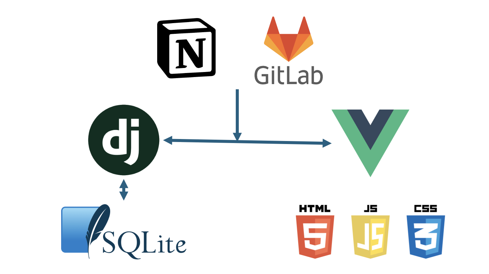

<div>
  <h1 align="center">
    <font align="left" size="6" color="#0056b3">MM💸</font>
  </h1>
</div>

<br/>
<br/>
<br/>

<div>
    
</div>

<br/>
<br />

<div align="center"> 
    <h3> SSAFY 11기 서울 1반 관통 프로젝트 </h3>
    <br />
    <p> 금융 정보를 한 곳에 알 수 있는 웹 애플리케이션, MM.</p>
</div>

<br/>

## 👨‍👩‍👧‍👧 팀원

<table align="center">
  <tr>
    <td>
        
    </td>
    <td>
        
    </td>
  </tr>
  <tr>
    <td align="center">
        송민정
    </td>
    <td align="center">
        유태람
    </td>
  </tr>
    <tr>
    <td align="center">
        Front-end 개발 담당,
        Back-end 개발 보조
    </td>
    <td align="center">
        Back-end 개발 담당,
        Front-end 개발 보조
    </td>
  </tr>
</table>
<table align="center">
  <tr>
    <td align="center" width="165"><strong>Front-end 기술 스택</strong></td>
    <td>
      <div>
        
        
        
        
        
      </div>
    </td>
  </tr>
  <tr>
    <td align="center" width="165"><strong>Back-end 기술 스택</strong></td>
    <td>
      <div>
        
        
        
        
      </div>
    </td>
  </tr>
  
<table>


<br/>

## 📡 아키텍쳐




## ERD


<br/>

## 프로젝트 설치 및 실행 
```bash 
# npm 

npm install axios

npm i vue3-kakao-maps

npm install --save @fortawesome/fontawesome-svg-core @fortawesome/free-solid-svg-icons @fortawesome/vue-fontawesome

npm run dev
```

```bash
# Django

python -m venv venv

source venv/Script/Activate

pip install -r requirements.txt

python manage.py migrate

python manage.py loaddata fixtures/deposits.json 
python manage.py loaddata fixtures/finances.json

python manage.py runserver

```


<br>


## 👀 프로젝트 주요 기능

<table align="center">
<thead>
  <tr>
    <td align="center"><strong>화면</strong></th>
    <td align="center"><strong>기능</strong></th>
  </tr>
  </thead>
  <tbody>
    <tr>
      <td>
        
      </td>
      <td>
        <b>로그인/회원가입 기능</b>
        <div>회원가입을 하고 로그인을 할 수 있습니다.</div>
      </td>
    </tr>
    <tr>
      <td>
        
      </td>
      <td>
        <b>예적금 금리 비교</b>
        <div>가입 가능한 상품을 모두 확인할 수 있습니다. 은행 또는 예치기간을 선택하여 상품 목록을 필터링 할 수 있도록 하였습니다. </div>
      </td>
    </tr>
    <tr>
      <td>
        
      </td>
      <td>
        <b>예적금 금리비교 상세페이지</b>
        <div>선택한 금융 상품에 대해 자세한 정보를 출력합니다. 아래 추가하기 버튼을 누르면 해당 회원의 가입한 상품 목록에 상품이 추가되며, 개인 회원 페이지에서 확인 가능합니다.</div>
      </td>
    </tr>
    <tr>
      <td>
        
      </td>
      <td>
        <b>환율 계산기</b>
        <div>현재 환율 정보를 가져와 국가를 선택하면 해당 통화로의 환전 금액을 반환합니다.</div>
      </td>
    </tr>
    <tr>
      <td>
        
      </td>
      <td>
        <b>근처 은행검색</b>
        <div>KAKAO MAP API를 활용하여 지도를 표시합니다. 위치와 은행은 미리 DB에 저장하여 불러옵니다. 시도를 선택하면 시도에 맞는 시군구를 필터링하여 가져옵니다. 선택시 해당 위치 근처의 은행정보를 출력합니다. </div>
      </td>
    </tr>
    <tr>
      <td>
        
      </td>
      <td>
        <b>게시글 조회, 생성, 삭제, 수정</b>
        <div>회원 소통 커뮤니티 게시판을 구현하였습니다. 게시글 조회, 생성, 수정, 삭제 기능이 구현되어있습니다.</div>
      </td>
    </tr>
    <tr>
      <td>
        
      </td>
      <td>
        <b>댓글 조회, 생성, 삭제, 수정</b>
        <div>댓글 조회, 생성, 수정, 삭제 기능이 구현되어있습니다</div>
      </td>
    </tr>
    <tr>
      <td>
        
      </td>
      <td>
        <b>프로필 페이지</b>
        <div>회원 기본 정보를 출력합니다. 정보를 수정할 수 있도록 모달창을 설정해두었습니다.</div>
      </td>
    </tr>
     <tr>
      <td>
        
      </td>
      <td>
        <b>프로필 페이지-가입한 상품 정보</b>
        <div>예적금 페이지에서 추가한 예적금 상품 정보를 확인 가능합니다. 각 상품에 대한 6, 12, 24, 36개월의 금리와 최고금리 그래프가 함께 출력됩니다.</div>
      </td>
    </tr>
     <tr>
      <td>
        
      </td>
      <td>
        <b>챗봇 서비스+추천시스템</b>
        <div>GPT-4o API를 활용하여 챗봇 서비스를 구현하였습니다. DB에 보유하고 있는 예적금 데이터를 학습시켜 은행명을 입력하면 해당 은행의 예적금 상품 정보를 출력합니다.</div>
      </td>
    </tr>
  </tbody>
<table>

<br/>

## 느낀점


<div>
  태람 💪 : 개발자가 되고자 진로를 정한지 반년 정도가 지났고 처음으로 진행한 프로젝트였다.

  교육 중 프로트엔드와 백엔드 두 가지 다 접할 수 있었고 이에 프로젝트를 진행하며 양 쪽을 모두 알 수 있어 진행을 잘 할 수 있었던 것 같다.
  
  보통 백엔드면 백엔드만, 프론트엔드면 프론트엔드만 맡아서 분업을 하지만, 팀장과 나 둘 다 프론트, 백에 지식이 있어 원할한 소통과, 분업을 더욱 잘 할 수 있었다.

  새삼 짧은 기간에 많이 역량을 끌어올렸다는 것을 느낄 수 있었다.
</div>
<div>
  민정 🥳 : 개발이 어떤건지 알게된 프로젝트였다. 자신없던 프론트엔드 개발에 재미를 느끼고 흥미를 느끼게 된 계기가 된 것 같다. 많은 400에러와 DB와의 충돌 머리아픈 css를 거치고 나니 다음 프로젝트는 조금 더 잘할 수 있을 것 같다는 생각이 들었다.
  
  스스로에게 칭찬할 점은 프론트엔드의 구조를 이해하고 코드를 작성했다는 점, 에러가 나면 어떻게든 다 뜯어서 해결하려고 시도했고, 그것을 해낸 노력과 시간이다. 또한 백엔드를 맡은 태람이와 계속 소통하고 커밋하고 푸시하면서 큰 문제없이 명세를 수행해낸 점이다. 

  다만 아쉬운 것은 원래 추천 시스템을 룰렛 돌리기를 구현하려고 했다. ( 강사님의 프로젝트 팀 뽑기처럼 ) 그치만 프로젝트 중간에 면접을 가게 되면서 구현에 쓸 수 있는 시간이 많이 줄어 포기한 점이 아쉬웠다. 또한 미적 역량이 부족해 완성도가 조금 부족해보이는 css 가 아쉽다. 

  같이 팀을 해준 태람이에게 고맙고, 다음 개발 프로젝트는 조금 더 기대할 수 있게 된 경험이었다. 

</div>

*더 재미있는 좌충우돌 개발 이야기는
[개꿀잼 개발 일기]("project_readme.md")에서 확인하세요.